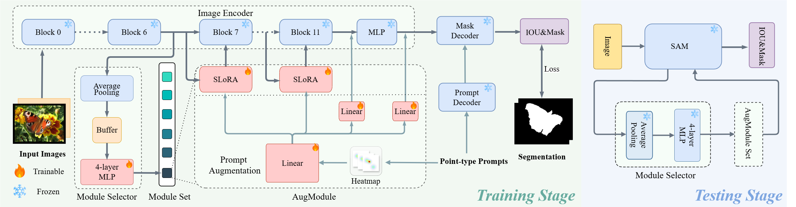

<div align="center">

# SAMCL: Empowering SAM to Continually Learn from Dynamic Domains with Extreme Storage Efficiency
</div>


## 📚 TL;DR (Too Long; Didn't Read)

**SAMCL** empowers SAM with the continual learning (CL) ability across dynamic domains. At a high level, **SAMCL** decomposes incremental knowledge into separate modules and trains a selector to choose the appropriate one during inference. To tackle both effectiveness and storage efficiency, we introduce two components for **SAMCL**: *AugModule* and *Module Selector*.

## 🛠️ Implementation

### Environment
```
conda create -n SAMCL python=3.10
conda activate SAMCL

cd sam2
pip install -e .
```

### Datasets
All training datasets are stored in the following form (Take Kvasir-SEG dataset as an example):
```
data/Kvasir/
├── test/
    ├── images/
        ├── 0.png
        ...

    ├── masks/
        ├── points.json
        ├── 0.png
        ...
├── train
    ├── images/
        ├── 0.png
        ...

    ├── masks/
        ├── points.json
        ├── 0.png
        ...
```

All datasets need download from their official webset and then process to the above format.

```points.json``` stored the static points of each instance, which is used in main papaer. You can run ```generate_point.py``` for generating new points.

### Checkpoint
Download official [checkpoint](https://dl.fbaipublicfiles.com/segment_anything/sam_vit_b_01ec64.pth) of Vit-B version SAM and [checkpoint](https://dl.fbaipublicfiles.com/segment_anything_2/092824/sam2.1_hiera_tiny.pt) of tiny version SAM2.1 to ```checkpoint/```.

There are already pre-trained SAMCL checkpoints with SAM and SAM2 in ```checkpoint/``` for simple testing.

### Usage

- Simple Testing
```
# SAMCL with SAM
python test.py --module SAMCL --cuda 0

# SAMCL with SAM2.1
python test_SAM2.py --module SAMCL_2 --cuda 0
```

- Training in CL manner
```
# Distributed Training
CUDA_VISIBLE_DEVICES=0,1,2,3 torchrun --nnodes 1 --nproc_per_node 4 --master_port=2412 train.py --module SAMCL --batch_size 2 --cuda -1

CUDA_VISIBLE_DEVICES=0,1,2,3 torchrun --nnodes 1 --nproc_per_node 4 --master_port=2412 train_SAM2.py --module SAMCL_2 --batch_size 4 --cuda -1


# Single GPU
python train.py --module SAMCL --batch_size 8 --cuda 0 

python train_SAM2.py --module SAMCL_2 --batch_size 16 --cuda 0 
```

